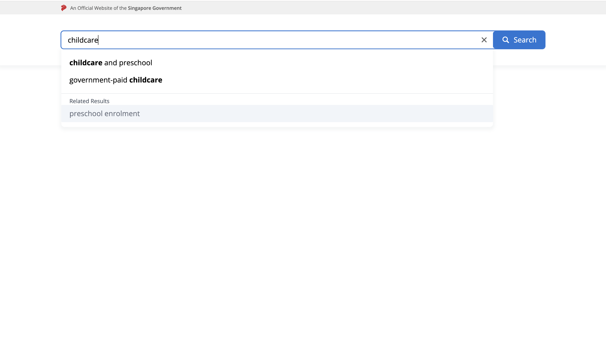
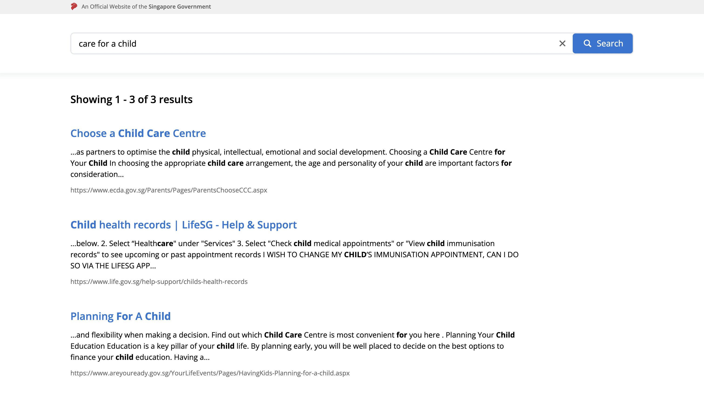
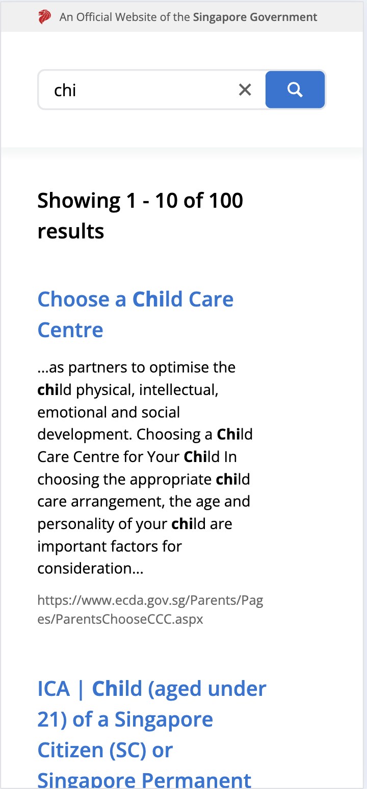
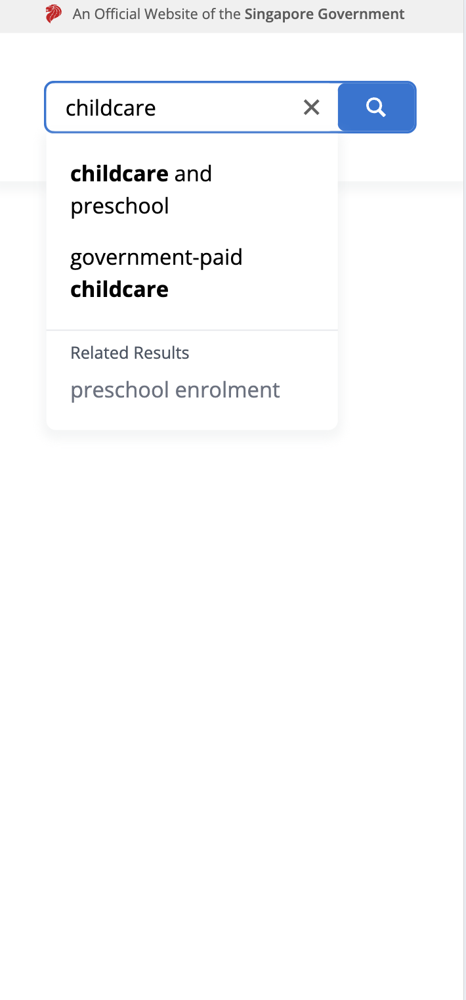
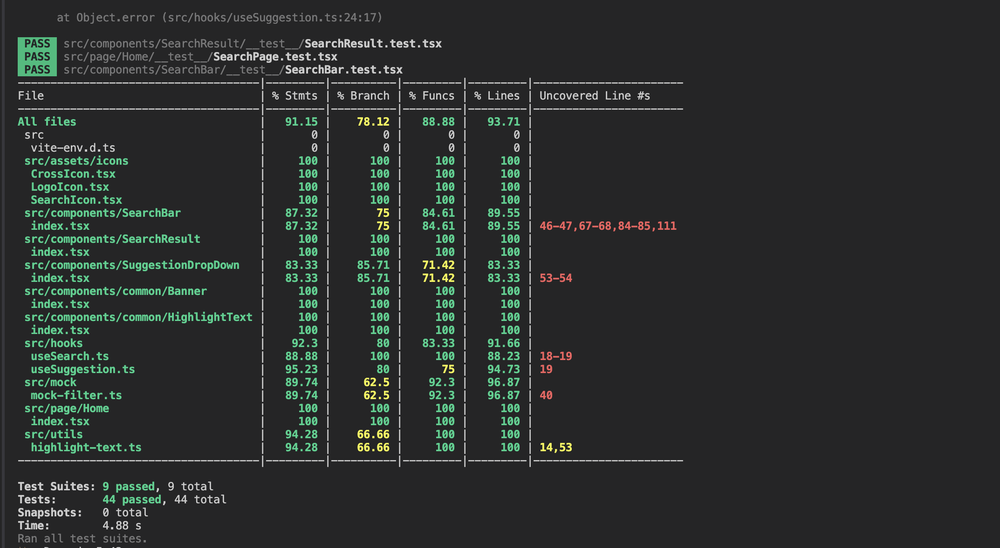

# React Search App  

This repository contains a search functionality implementation using React, TypeScript, and Tailwind CSS. The project includes search filtering, suggestions, and result highlighting.  

## Table of Contents  
- [Overview](#overview)  
- [Preview](#preview)  
- [Deployment](#deployment)  
- [Libraries Used](#libraries-used)  
- [Installation](#installation)  
- [Running the Project](#running-the-project)  
- [Running Tests](#running-tests)  
- [Assumptions](#assumptions)  

## Overview  

This project is designed to demonstrate search-related features, including:  
- Filtering search results based on a keyword.  
- Providing search suggestions dynamically.  
- Highlighting matched keywords within the results.  

The search logic is handled entirely on the frontend, processing static data received from an API.  

## Preview  

### 🔍 UI Screenshots  

#### Web View  
- **Home Page & Search Functionality**  
    

- **Search Results with Highlighted Keywords**  
    

#### Mobile View  
- **Mobile Search UI**  
    

- **Mobile Search Results**  
    

### ✅ Test Coverage Report  
  

## Deployment  

This application is deployed using **AWS CloudFront + S3** as a static site. You can access the live version here:  

🔗 **[Live Demo](https://d1iyta6uxh0hou.cloudfront.net/)**  

## Libraries Used  

- **React**: A JavaScript library for building user interfaces.  
- **TypeScript**: A typed superset of JavaScript.  
- **Jest**: A testing framework for JavaScript applications.  
- **Tailwind CSS**: A utility-first CSS framework for styling.  

## Installation  

Follow these steps to set up the project locally:  

1. Clone the repository:  
   ```sh  
   git clone https://github.com/manhhhh8321/react-search-app.git  
   cd react-search-app  
   ```  
2. Install dependencies:  
   ```sh  
   yarn install  
   ```  

## Running the Project  

To start the development server, run:  
```sh  
yarn run dev  
```  
Then, open your browser and go to `http://localhost:5173`.  

## Running Tests  

To execute the test suite, run:  
```sh  
yarn run test  
```  
Test coverage reports & UI screenshots are generated in the `screenshots` folder.  

## Assumptions  

- The search functionality includes a **synonym-based suggestion system**, which means when a user enters a search term, the system will check for synonyms and display **additional suggestions** in the dropdown.  
- The application does **not** perform server-side searching; all search logic is handled on the frontend.  
